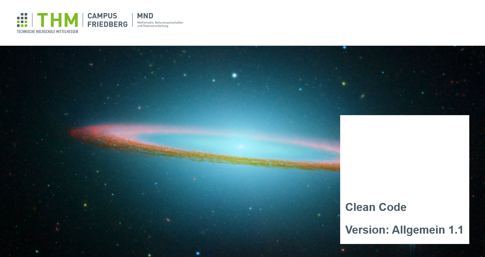

#### Welcome to my Website :D
###### (Warning: This website is still under construction)

## About me

    I'm Cong Nguyen. My academic foundation in Business Informatics and Media Informatics at THM paved the way for a fulfilling career in software development. Currently, at Sopra Steria, I'm immersing myself in the expansive world of cloud technologies, acquainting myself with modern tools like Docker, Kubernetes, and the Go programming language.

    Outside of my primary work, I've been navigating the realms of functional programming, finding intrigue in languages such as F# and LISP. This exploration reflects my belief in continuous learning and the power of a growth mindset.

    On a personal note, philosophy holds a special place in my interests. I regularly delve into foundational concepts like logic, and the teachings of Stoicism and Daoism resonate deeply with me, offering a holistic perspective on life's complexities.

    In my community, my association with the voluntary fire brigade stands testament to my dedication to service and the well-being of those around me.

    With an ever-curious spirit, I eagerly anticipate the challenges and learning opportunities that lie ahead, cherishing the journey as much as the destination.

## Building a People Management REST API: Integrating Kubernetes with Go

    Interested in exploring Kubernetes and its capabilities? Or perhaps you're proficient in Go and are looking to integrate it with Kubernetes for more robust applications? This guide will provide a structured approach to developing a Go application, tailored for Kubernetes, which focuses on managing people data through a RESTful API. This comprehensive walkthrough will cover everything from setup to deployment, enabling you to proficiently harness the potential of Kubernetes with Go for backend development. Join us to understand the synergy between these two powerful platforms and refine your backend development strategies.

#### Foundations
 

    Before diving deep into the technical intricacies and the development process, let's first lay out the tools and technologies we will be utilizing. Grasping these foundational elements will help you comprehend the workflow better and tap into the potential of each technology.

###### Digital Ocean and Kubernetes:
    Kubernetes Cluster on Digital Ocean: For this tutorial, we'll be employing Digital Ocean to establish a Kubernetes cluster. This can be done either through the command line interface (CLI) or via Digital Ocean's graphical user interface (GUI). The choice between CLI and GUI hinges on your comfort level and prior experience.

 ###### Container Technology:
    Docker on WSL (Windows Subsystem for Linux): Docker allows us to "containerize" our applications, facilitating easier deployment and scaling. Instead of installing Docker directly on Windows, we'll be leveraging it within the WSL (Windows Subsystem for Linux) for smoother integration and optimal performance. All Docker commands will be executed through the CLI.

###### Development Environment:
    VS Code: Visual Studio Code, commonly referred to as VS Code, is a popular code editor with a plethora of extensions that ease Go development. With its integration capabilities with WSL and Docker, it stands as an ideal environment for our project.

    Go 1.21: Our primary development language for the backend logic will be Go, and for this tutorial, we're using version 1.21. Go is renowned for its performance and simplicity, making it a prime choice for contemporary backend development.

###### Registry:
    Digital Ocean Registry: To securely and efficiently store our Docker images, we'll utilize the registry provided by Digital Ocean. It offers the capability to host private Docker images, which facilitates integration with our Kubernetes cluster on Digital Ocean.
    With these foundations set, we are now ready to venture into the actual application development. In the next segment, we'll discuss initializing our Go project, setting up our Kubernetes cluster, and weaving these technologies together.

## Understanding Clean Code: Insights from Cong Nguyen

 

    In the intricate world of software development, how often do we pause and reflect on the quality of our code? I'm Cong Nguyen, and I've ventured through both academia and industry, consistently emphasizing the pivotal role of clean coding practices.

    With software complexities on the rise, navigating the maze of "Legacy Code" becomes a common challenge. But there's a roadmap to clarity: the SOLID principles. These guidelines not only aid in creating maintainable code but also ensure it's scalable.

    Yet, Clean Code isn't just about principles. It's a balance between readability, maintainability, and performance. And the programming paradigms we embrace further shape this balance.

    Join me as we delve deeper into the essence of Clean Code, exploring its principles and understanding its lasting impact on software quality. Your journey towards coding excellence begins here.

**[Read more](https://github.com/Koschnag/CleanCode/blob/master/ProseminarCongNguyenCleanCodeFinalVersion.pdf)**
